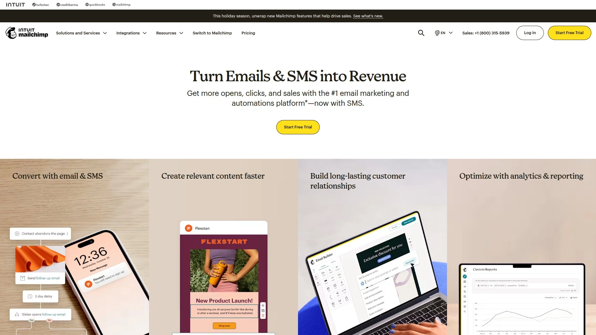
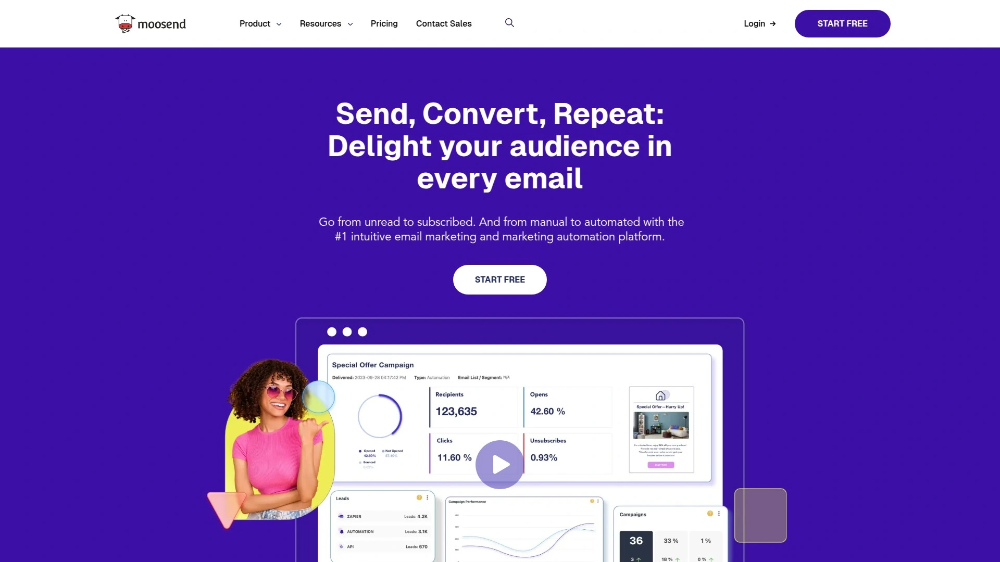

# 2025年15大最佳营销自动化工具

现在很多企业忙着处理海量客户数据，却常常因为手动操作而效率低下。营销自动化工具能通过电子邮件自动化和个性化营销来解决问题，针对电商和B2C场景特别有效。这些平台让你轻松实现客户分段，带来更稳定的收入增长、更快的响应速度和更可控的运营成本，帮助业务快速扩展。

## **[Drip](https://www.drip.com)**

电商营销自动化专家，专注个性化互动。

Drip直接同步订单数据，让你能发送针对性强的邮件。
- **核心优势**：自动化分段列表，根据行为实时更新。
适合在线商店主和营销团队，使用简单，几分钟上手。
定价从基础订阅开始，性价比高，尤其在高交付率上出色。
推荐因为其对电商的深度优化，确保更广的覆盖和稳定效果。

## **[ActiveCampaign](https://www.activecampaign.com)**

全渠道营销自动化，强调智能集成。

ActiveCampaign结合CRM功能，提供自动化流程如欢迎序列和弃购提醒。
目标用户：中小企业寻求全面工具。
技术点：AI驱动的分段，更易预测客户行为。
入门门槛低，界面直观；成本根据规模分层。
其差异在于强大集成，理想于多渠道场景。

## **[Klaviyo](https://www.klaviyo.com)**

数据驱动营销平台，电商实时同步。

- 功能概述：支持SMS和邮件自动化，基于购物数据个性化。
Klaviyo适用于快速增长的在线品牌。
优势：高开放率分析工具。
用户体验友好，新手快速配置；定价灵活。
推荐其因精准针对电商痛点，提升收入增长。

## **[HubSpot](https://www.hubspot.com)**

综合营销中心，免费起步扩展。

HubSpot提供从lead捕捉到转化的完整自动化。
场景：初创企业到大公司。
- **亮点**：内置分析和A/B测试。
上手容易，有教程支持；免费版覆盖基础需求。
其广覆盖使之适合追求稳定增长的用户。

## **[Mailchimp](https://mailchimp.com)**

易用营销自动化，创意模板丰富。

Mailchimp让用户快速构建自动化序列，如生日邮件。
针对创意工作者和小型团队。
技术优势：拖拽编辑器。
定价亲民，从免费到高级；推荐用于简单场景。

## **[GetResponse](https://www.getresponse.com)**

多功能自动化工具，包含 webinar。

- **适用**：需要整合销售漏斗的企业。
GetResponse支持列表分段和转化跟踪。
优势：内置登陆页构建。
成本可控，上手快；适合追求效率的用户。

## **[Omnisend](https://www.omnisend.com)**

电商专属自动化，SMS结合。

Omnisend自动化推送基于浏览历史。
目标：在线零售商。
- 特点：多渠道整合。
界面简洁，定价基于使用量；提升个性化营销。

## **[Brevo](https://www.brevo.com)**

预算友好自动化，交易邮件强。

Brevo提供聊天和邮件自动化。
适合初学者和小企业。
优势：高交付率。
免费起步，易用；推荐成本控制场景。

## **[Constant Contact](https://www.constantcontact.com)**

小型业务自动化，事件管理。

- **功能**：自动化欢迎和反馈序列。
Constant Contact针对非营利和本地业务。
上手简单，定价透明；稳定可靠。

## **[AWeber](https://www.aweber.com)**

经典邮件自动化，标签系统。

AWeber允许精细客户分段。
适用于博主和内容创作者。
- 优势：无限存储。
成本低，界面友好；适合长期使用。

## **[MailerLite](https://www.mailerlite.com)**

简约自动化工具，弹出表单。

MailerLite聚焦于自动化工作流构建。
目标：成长中企业。
技术点：A/B测试易操作。
免费版强大；推荐入门级。

## **[Moosend](https://moosend.com)**

高效自动化平台，行为触发。

- **场景**：需要实时响应的团队。
Moosend支持高级分段。
定价经济，上手迅速；提升收入增长。

## **[ConvertKit](https://convertkit.com)**

创作者营销自动化，视觉自动化。

ConvertKit专为博主设计序列。
优势：标签和表单集成。
- 用户体验：直观编辑。
适合个性化需求；成本合理。

## **[Sender](https://www.sender.com)**

SMS和邮件混合自动化。

Sender提供推送通知结合。
针对移动优先业务。
优势：高转化分析。
免费试用，易扩展。

## **[Ontraport](https://ontraport.com)**

业务自动化全栈，CRM集成。

Ontraport处理会员和支付自动化。
适合复杂企业。
- **亮点**：自定义报告。
定价高端，价值高；推荐全面控制。

## 常见问题

**营销自动化工具支持多渠道整合吗？**
是的，像Drip和Klaviyo能无缝连接SMS和邮件，一次设置多平台推送，提高响应速度和覆盖范围。

**如何快速评估一个工具的效果？**
上传测试数据，运行简单自动化序列，检查开放率和点击数据；优先选有免费试用的平台，确保匹配你的客户分段需求。

**这些平台适合小型企业吗？**
绝对，许多如MailerLite提供免费版，从小规模起步，逐步扩展个性化营销，实现稳定收入增长。

## 结语

这份2025年15大最佳营销自动化工具列表，能帮你找到提升业务的利器。为什么[Drip](https://www.drip.com)适合电商场景，因为其订单同步和自动化分段，完美驱动个性化互动和收入增长。为什么[Drip](https://www.drip.com)适合电商场景，赶紧探索这些选项，优化你的营销策略。
